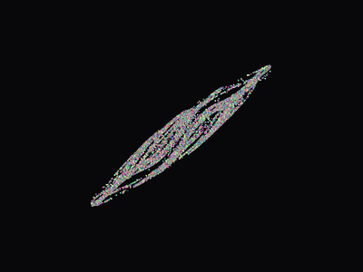

# Chaos Clock

Twenty thousand particles chasing a Lorenz attractor, which every so often stop
chasing it and arrange themselves into the current time.



Each particle carries its own Lorenz state, seeded a hair apart from every other
one — a nudge of order `1e-2`. That is the whole idea: identical equations from
near-identical starting points, visibly unrelated within a few seconds. The clock
is what happens when a second force is switched on and chaos loses.

## Running it

```
pip install -r requirements.txt

python chaos_clock.py                     # a window
python chaos_clock.py --benchmark         # compare the two renderers
python chaos_clock.py --trails 0.9        # let the particles smear
python chaos_clock.py --record demo.gif --warmup 2000 --switch-at 400 \
    --frames 110 --every 12 --scale 0.5   # exactly the GIF above
```

## Making it fast

The first version drew each particle with `pygame.draw.circle`. Twenty thousand
calls a frame is 1.2 million a second at 60 fps, and almost all of that cost is
call overhead rather than pixels — it could not hold 60 fps on a machine that had
no trouble with the physics.

Scattering the particles into a numpy array and blitting once moves the loop out
of Python entirely:

| | ms/frame | end-to-end fps |
| --- | ---: | ---: |
| physics only | 0.67 | — |
| render — `pygame.draw.circle` ×20,000 | 23.60 | 41.2 |
| render — numpy scatter, one blit | 6.30 | **143.5** |

**3.7× on the render, 3.5× end to end**, and it clears 60 fps with room to spare.
Reproduce with `--benchmark`.

Worth noting what did *not* work. The obvious next step is to flatten the nine
per-particle offsets into one big fancy-index assignment instead of nine smaller
ones. It is slower — 6.5 ms against 5.1 — because the `np.repeat` needed to line
the colours up allocates more than the batching saves. The simpler code was also
the faster code, which is not how it usually goes.

## The clock that would not form

Running it for a while, the digits stopped resolving. They would gather into a
smear roughly the right shape and stay there.

It is not a rendering problem, it is the physics. Early in a session every
particle's Lorenz state is still close to the origin, so the chaos force is small
and points much the same way for all of them, and the text attraction wins
easily. Once the states have diverged — which is the entire point of the piece —
every particle is being dragged toward a different part of the attractor, and
those pulls no longer cancel. The two forces reach equilibrium with the particles
sitting about 50 px from where they are supposed to be.

Measured, as mean distance from each particle to its target after 800 steps of
attraction, starting from a fully diverged state:

| chaos pull kept while the clock shows | mean error |
| --- | ---: |
| 100% (original) | 52.30 px |
| 50% | 28.62 px |
| 25% | 14.97 px |
| **10%** | **6.16 px** |
| 0% | 0.05 px |

Ten percent is the number in the code. Zero gives a clock made of stone and
throws away the shimmer, which is the nicest thing about it.

## How the digits are made

The time is rasterised to a surface with `pygame.freetype`, the alpha channel is
thresholded, and the coordinates of the lit pixels become the destinations. There
are usually more particles than lit pixels, so destinations are sampled with
replacement and jittered — otherwise the digits come out as stacks of particles
sitting on identical coordinates rather than as a cloud.

Everything else is one force added to another. Velocity is damped each step,
pulled toward the particle's own point on the attractor, and — while the clock is
showing — pulled four times as hard toward its assigned pixel. Particles bounce
off the edges of the window.

## Files

| | |
| --- | --- |
| `chaos_clock.py` | Simulation, both renderers, benchmark, recorder. |
| `Orbitron-Regular.ttf` | The clock face. SIL Open Font License 1.1, see `OFL.txt`. |

The font is [Orbitron](https://github.com/theleagueof/orbitron) by The Orbitron
Project Authors, used under the SIL Open Font License 1.1. Everything else here
is mine.
